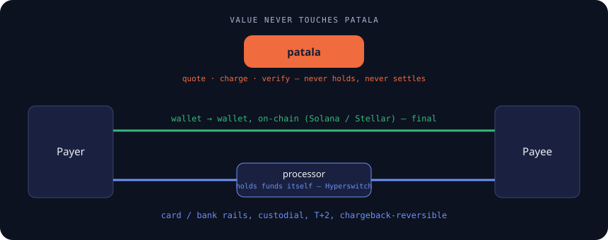
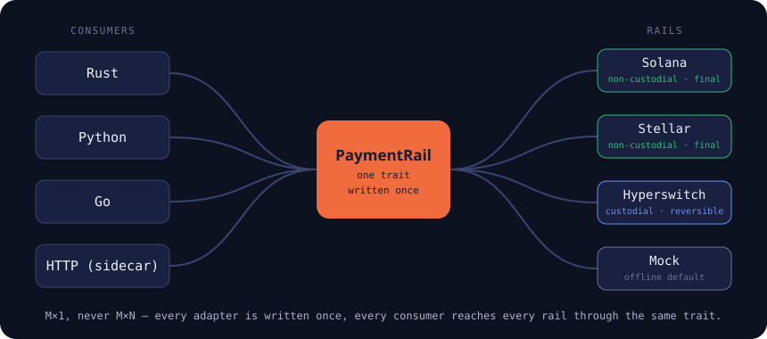

<p align="center">
  
</p>

<h1 align="center">patala</h1>

<p align="center">
  A sovereign, centerless payment-rail substrate. One interface to move value —
  fiat or crypto — that any product can vendor and self-host.
</p>

<!-- Plain-text badge on purpose: rendering this README triggers no external
     image fetches — the same no-default-network-calls ethos as the rails. -->
<p align="center">
<sub><a href="LICENSE-MIT">MIT</a> OR <a href="LICENSE-APACHE">Apache-2.0</a> · Rust · non-custodial · no token</sub>
</p>

The platform holds no funds, takes no cut, and no one owns the network.
**patala** is Sesotho/Setswana for *"to pay."* Part of the Vulos family
(`vula` = "open"). `PATALA.md` is the anchor spec and single source of truth;
this README describes what is actually built, honestly, as it lands.

patala is a **library and a sidecar — there is no GUI**. Everything below is
either a crate, a trait, or a process you run next to your own app.

## Status: foundational — built and unit-tested, rails unverified against live networks

The core, the rails and the polyglot layer are all in this repo. `make check`
runs two passes and both are gates: **168 offline tests** in the default
workspace build, and **547 more** once every processor feature is compiled in
(`cargo test -p patala-fiat --all-features` + `cargo test -p patala-py
--features fiat-all`). Clippy-clean, fmt-clean; the default build pulls no
chain and no processor.

What that does *not* mean: **no rail here has been run against a live
network or a live merchant account from this repo** — each says so plainly
in its own README, and the crypto rails name the exact step to validate
(fund a testnet account, run the `#[ignore]`d, env-gated live test). Treat
the rails as a tested foundation to validate against testnet/sandbox, not as
production-proven.

The things that genuinely executed end-to-end are the **Python binding, the
Go binding and the sidecar** — real round-trips over a real interpreter,
real cgo, and a real socket. All three are CI jobs now: the two Rust passes,
the Python smoke run, and the Go binding's test suite (CI installs
`uniffi-bindgen-go` at the pinned tag and uses the C toolchain the runner
already has).

## The idea

Payment adapters split into two kinds, and patala treats them completely
differently:

| | Fiat processors (Stripe, Paystack, Xendit, …) | Crypto rails (Solana, Stellar, …) |
|---|---|---|
| Shape | REST calls + webhook verification | tx construction + signing + chain RPC |
| Trust | custodial, **reversible** (chargebacks), KYC, T+2 | non-custodial, **final**, wallet-based, near-instant |
| Build vs. adopt | **adopt** — Hyperswitch already ships 100+, Apache-2.0, Rust, self-hostable | **build** — this is the part nobody provides non-custodially |

The whole value add is (a) the non-custodial crypto rails, and (b) a thin
capability layer that presents both classes behind one honest interface, with
failover, and never blurs which class you're getting. See `PATALA.md` §2 for
the full reasoning.

<p align="center">
  
</p>

## The seam

```
patala-core/   trait + capability model + FailoverRail + MockRail + errors + receipt + webhook
```

Every consumer of patala programs against one trait — `PaymentRail` — and one
capability descriptor — `RailCapabilities`. Nothing names a provider-specific
type. The settlement class (`CustodialReversible` vs `NonCustodialFinal`)
lives in the type, not a flag, because it changes what you owe the payer.

This is `patala-core`'s own crate-level doctest, word for word — it runs
under `cargo test --doc` on every `make check`:

```rust
use patala_core::{MockRail, PayRequest, PaymentRail, RailClass};

let rail = MockRail::new("mock", RailClass::NonCustodialFinal, vec!["USDC".into()]);

let req = PayRequest {
    amount_minor: 500, // 5.00 USDC — integer minor units, never a float
    currency: "USDC".into(),
    destination: "wallet-or-processor-token".into(),
    reference: "order-1".into(),
};

// `charge` returns the Receipt — the entitlement.
let receipt = rail.charge(&req).await.unwrap();
assert_eq!(receipt.reference, "order-1");

// Gate on `verify` returning `Ok(true)`, never on `charge` merely having
// returned `Ok`: a receipt can be stored and re-checked later, and only
// `verify` re-derives whether it still holds.
assert!(rail.verify(&receipt).await.unwrap());
```

Swap `MockRail` for a real one — or wrap several in a `FailoverRail`, which
tries them in order and refuses to silently cross from a `NonCustodialFinal`
request to a `CustodialReversible` rail — and nothing else in the code above
changes; that's the point of the seam. See `patala-core/README.md` for the
`FailoverRail` example, the full method list, and test instructions.

## Non-custodial, always

No code path anywhere in this repo may make patala hold funds. A rail can set
`holds_funds: true` on its own capabilities — that's the *rail's* processor
custodying money, e.g. Stripe behind Hyperswitch — but the substrate itself
never does. There is no balance table, no payout queue, no ledger.

## What's built

| Crate | What it is | Class | Tests | Live-verified? |
|---|---|---|---|---|
| `patala-core` | trait + capability model + `FailoverRail` + `MockRail` + the webhook seam | — | 19 + 1 doctest | offline by design |
| `patala-fiat` | 20 direct processor adapters + the ISO-4217 currency table + the offline `manual` rail | custodial, reversible | 533 (all features) | **no — no live merchant account** |
| `patala-solana` | SPL-USDC on Solana, ported from `magnetite-seams/src/solana/` | non-custodial, final | 41 (+1 gated) + 1 doctest | **no — testnet step in its README** |
| `patala-stellar` | native USDC on Stellar (SDF's own `stellar-xdr`/`stellar-strkey`) | non-custodial, final | 29 (+1 gated) + 1 doctest | **no — testnet step in its README** |
| `patala-hyperswitch` | adapter to a self-hosted Hyperswitch (its whole processor set as one rail) | custodial, reversible | 20 | **no — needs a live instance** |
| `patala-py` | one UniFFI surface → Python and Go today, Swift/Kotlin/wasm later | — | 14 Rust + 24 Go binding tests (`patala-go/bindingtest`) + ✓ ran under Python 3.13 and Go 1.25 | executed, and now CI-enforced |
| `patala-sidecar` | loopback HTTP over the core, token-gated, fail-closed | — | 9 (6 HTTP round-trips + 3 unit) | executed |

One honest caveat on that table: **the sidecar's rail registry is still
mock-only.** The server, its auth, its error mapping and all five endpoints
are real and exercised over a real socket, but `default_registry()` registers
exactly one rail — `"mock"`. Reaching a Solana, Stellar, Hyperswitch or fiat
rail *through the sidecar* needs the per-rail registration its
`patala-sidecar/src/registry.rs` documents and does not yet have. Everything
else in the table is built code with tests behind it.

**Fiat coverage is Hyperswitch's coverage, plus twenty direct adapters.** Any
processor Hyperswitch supports is a config value — **Paystack is supported**
(confirmed in Hyperswitch's connector list), so it's free through the adapter.
A processor Hyperswitch lacks — **PayFast**, for example (confirmed absent) —
gets a direct adapter in `patala-fiat` against the same `PaymentRail` trait;
PayFast is one of the twenty that exist today. Nothing is ever locked out.

Every rail beyond the mock is feature-gated and optional; the default build of
this repo stays fully offline no matter how many rails exist here.

## One trait, both directions

Every consumer — Rust, Python, Go, or an HTTP client talking to the sidecar —
gets the same six methods on `PaymentRail`: `id`, `capabilities`, `quote`,
`charge`, `verify`, and `verify_webhook`. The last one is the *push* path:
`verify` is for when you hold a receipt and want it re-derived; `verify_webhook`
is for when the processor calls you and you need to know the delivery is
genuine. Both live on the trait deliberately — anything beside it is invisible
to every consumer that dispatches through `dyn PaymentRail`, which leaves them
able only to poll.

## The polyglot layer — one adapter, three ways in

Every adapter is written once, in Rust, in `patala-core` or a rail crate.
Nothing is reimplemented per language:

<p align="center">
  
</p>

1. **Rust** — direct, `patala-core` plus whichever rail crates you enable.
2. **`patala-py`** — one UniFFI surface, generating both the Python binding
   and (via `uniffi-bindgen-go`) the Go binding in `patala-go/`. Real
   round-trips, real cgo, CI-enforced on both languages.
3. **`patala-sidecar`** — a thin local HTTP server over the core, token-gated
   and fail-closed. Any language with an HTTP client can drive the substrate
   with zero FFI; keys live in one hardened process instead of being smeared
   across every app.

## Security

No code path holds funds; every receipt fails closed if it can't be
verified; a rail that can't do a refund or a webhook check returns
`Unsupported` rather than faking one. See `SECURITY.md` for the reporting
process and the full scope — and for the plain statement that **patala
publishes no artifacts today**, so there is nothing to sign or checksum yet.

## Deferred (designed for, not built)

Any-stablecoin mint generalization, an Algorand rail, and a gateway-discovery
phonebook. See `PATALA.md` §4. (A direct PayFast rail was on this list; it now
exists, as `patala-fiat`'s `payfast` adapter.)

## License

[MIT](LICENSE-MIT) OR [Apache-2.0](LICENSE-APACHE) — © VulOS. No token. No
protocol tax. All seven crates in this workspace declare
`license = "MIT OR Apache-2.0"` in their `Cargo.toml`, matching the pair
offered here — a tool resolving licences from crate metadata (`cargo deny`,
`cargo about`, an SBOM generator) sees the same grant a human reading this
file does.

---

<p align="center">
  <a href="https://vulos.org"></a><br>
  <sub><a href="https://vulos.org"><b>vulos</b></a> — open by design</sub>
</p>
